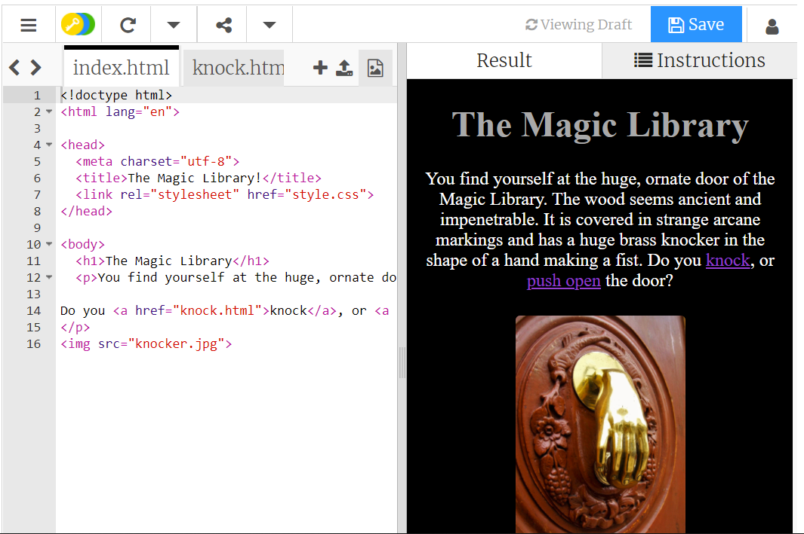

## Introduction

In this project, you will use your previous knowledge of creating web pages to make a cool choose your own adventure story with hyperlinks!

### What you will make

--- no-print ---
This is a very simple example choose your own adventure story titled *The Magic Library*. Navigate through some of the options in the story and see how it works!  

  <iframe src="https://trinket.io/embed/html/4cfbe71ae4?outputOnly=true" width="100%" height="600" frameborder="0" marginwidth="0" marginheight="0"></iframe></iframe>

--- /no-print ---

--- print-only ---

--- /print-only ---

--- collapse ---
---
title: What you will need
---
### Hardware

+ A computer or tablet

### Software

+ This project can be completed in a web browser using [trinket.io](https://trinket.io/) or [repl.it](https://replit.com/)

### Downloads

+ Download the project [starter file](http://rpf.io/p/en/projectName-go){:target="_blank"} if working offline

--- /collapse ---

--- collapse ---
---
title: What you will learn
---

+ Learning objective 1
+ Learning objective 2
+ Learning objective 3

--- /collapse ---

--- collapse ---
---
title: Additional information for educators
---

You can download the completed project [here](http://rpf.io/p/en/cyoa-web-get){:target="_blank"}.

If you need to print this project, please use the [printer-friendly version](https://projects.raspberrypi.org/en/projects/cyoa-web/print){:target="_blank"}.

--- /collapse ---
