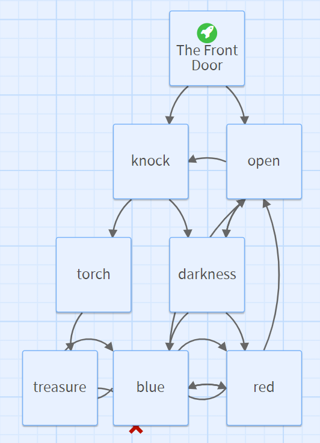

## Build your story website in HTML

The first thing we need to do to create our ‘Choose Your Own Adventure Website’ is to create a narrative where our reader can make choices that lead to other pages in the story.

In the included example site, *The Magic Library*, our reader is taken through a very simple narrative which branches into different options. If we look at a ‘map’ of our story, it would look something like this:



Each square in the map is a web page, and each arrow between them is a **relative link** that takes the reader to the corresponding page for their choices. These links are exactly the same as hyperlinks used to navigate to other webpages, but they only refer to other websites within your domain (which is kind of like a folder online where all your pages are stored - more on this later). 

You’ll need to decide upon the plot for your simple story, and plan out the different parts of it and how they link together. You can use a piece of paper to draw your ‘story map’, or use sticky notes, note cards or anything else you like!

In the example story, *The Magic Library*: 
+ You find a door at the very beginning -  which you can choose to knock on, or not. If you knock, you go down the ‘easy’ path. If you don’t, it’s the ‘hard’ path. 
+ The easy path provides you with a solution to the *good* ending, while the hard path leads to an infinite loop via some links which lead back to themselves and keep you stuck in the library forever - the *bad* ending.
+ At any time on the *hard* path, you can choose to go back and start again by walking back out of the library to the front door.

--- task ---
Plan out your story now using a story map. 

Some things to think about:

+ What are the major events in your story?
+ What choices will your reader get to make at each event?
+ What will the different choices lead to?
+ What is the ‘good’ ending, and what is the ‘bad’ ending?
--- /task ---

Once you have created your story map, you will be able to see how many pages you will need to create for your story. Each page should be a separate ```.html``` file with a distinct and easily recognisable name. 

In the example, you can see the pages are all simply titled with the main event on them: knock, open, torch, darkness etc. This makes it easy for you to know which page is which at a glance - it can get confusing sometimes!

--- task ---
Create a new, blank ```.html``` file for each one of the pages on your map. Give them sensible filenames and paste the HTML boilerplate here at the top of each one ready to code:

--- collapse ---

---
title: HTML Boilerplate
---

```<!doctype html>```
```<html lang="en">```

```<head>```
```  <meta charset="utf-8">```
```  <title>Put a Good Title for this page in Your Story!</title>```
```  <link rel="stylesheet" href="style.css">```
```</head>```

```<body>```

```Your Story elements go in here!```

```</body>```

```</html>```

Remember to change the ```<title>``` to something relevant and cool!
--- /collapse ---

--- /task ---

HTML provides the structure for our pages, but ot make the look really cool, we’ll need a stylesheet. You will be able to style your pages using CSS, which you should create now.

--- task ---
Create another blank file, called ```style.css```. This will be the stylesheet for your story website. 

Don’t start adding styling just yet, we’ll do that once we’ve checked our story works and plays properly. 
--- /task ---

--- task ---
Now that you have the major structure for your story website, you can start filling in each page’s ```<body>``` section with your story, using all the tags and tools you’ve learned about so far.

Don’t worry about linking all the pages yet, we will do that in the next step! For now, just go through each page of your story and write the narrative, including any choices the reader can make. You can also add images to your website if you like.

--- /task ---


--- save ---